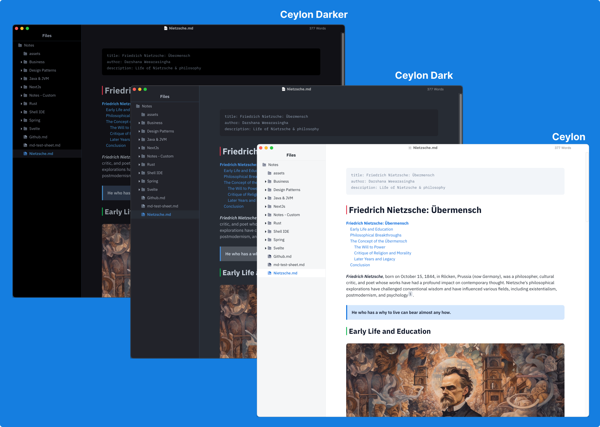
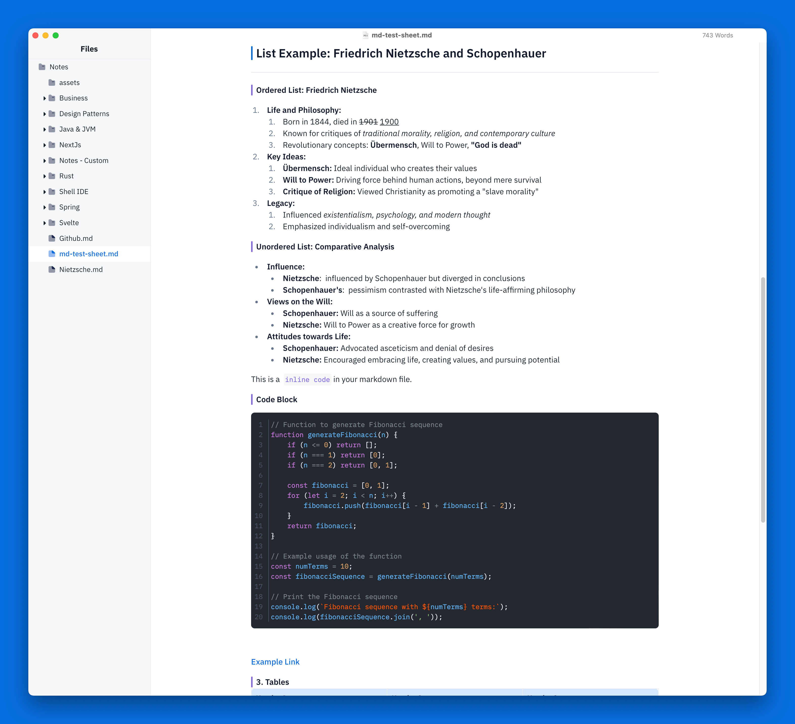
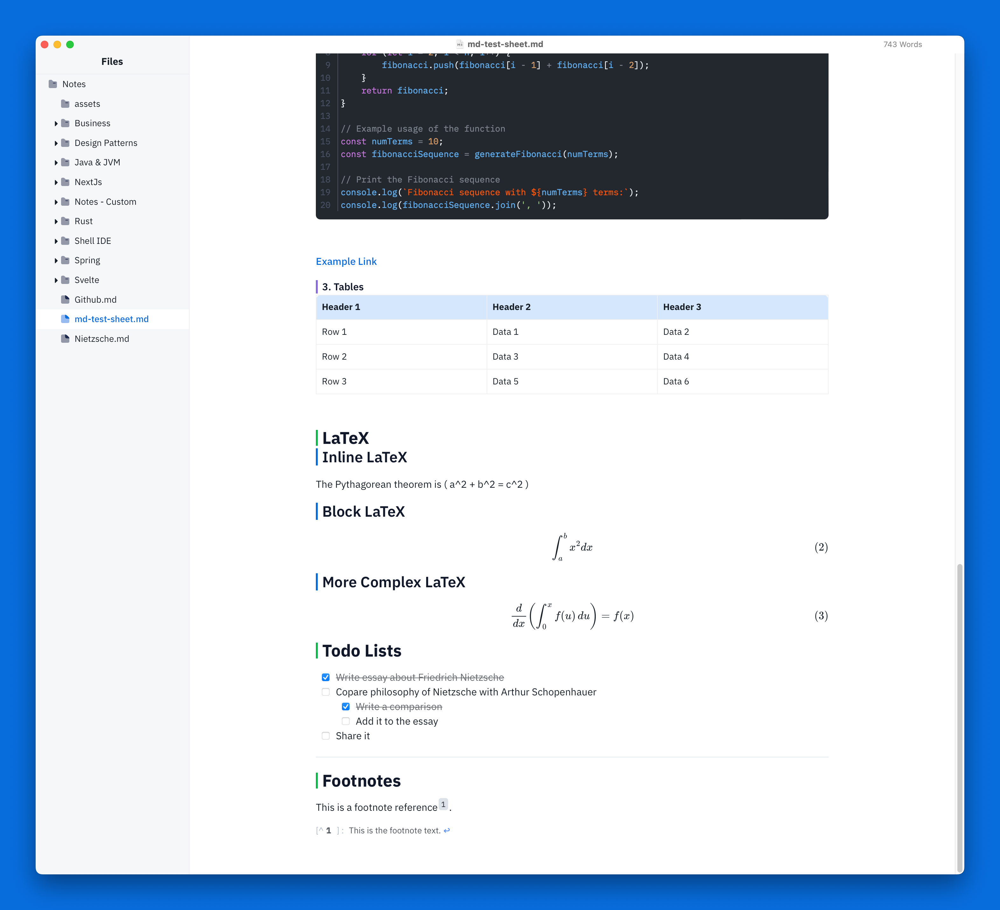

# Ceylon Theme for Typora

    

The following will demonstrate how this theme looks like in a MacOs os in Retina Display. The looks may change according to your OS and Screen configurations.

This theme is build from [Typora Vue theme](https://github.com/blinkfox/typora-vue-theme) and some looks from Obsidean Editor.

## Showcase

You can install this by downloading the latest version from [release page](https://github.com/tdarshana/typora-ceylon-theme/releases) and extracting it to your Typora theme folder. For the installation you can follow the official guide [here](https://theme.typora.io/doc/Install-Theme/).

Really appriciate if you can support me with a Kofi, or give this repo a star in Github.

Thank you!
